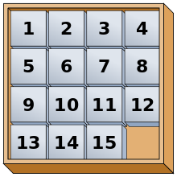

# 环境 🧶

- JDK 8
- Maven 3.8.x

# 使用 🛵

- 使用 Maven 打包：

- ```sh
    mvn clean package
    ```

- 运行（Windows CMD 脚本）：

- ```sh
    .\run.bat
    ```

`run.bat`这个脚本中定义了程序运行的各种参数，参数的含义写在了脚本的注释中，这里复制一份：

```sh
:: 参数设置 ::
:: 是否随机初始化N-puzzle实例
set RANDOM_GAME=true
:: 程序一次运行多少次N-puzzle实例，该值的有效性取决于 RANDOM_GAME 设置为true
set GAME_ROUND=2
:: 如果 RANDOM_GAME 设置为 false, 则必须提供自定义的 N-puzzle 实例文件的路径（相对或绝对）
:: N-puzzle 实例文件 的规则如下：
:: 1. 每个实例可视作一个矩阵，矩阵的每一行占据文本的一行，元素与元素之间使用空格隔开，每个元素都必须是自然数
:: 2. 实例与实例之间使用 --- 分隔
:: 3. 因此，合法的字符为：数字、空格、-和换行符，即^[\\d\\s\\-]+$
:: 4. 一旦检测到不正确的语法，程序暂停，不会继续运行之后的实例
set PROBLEM_FILE_PATH=./problems.txt
:: PUZZLE 有几行，该值的有效性取决于 randGame设置为true
set ROW_COUNT=3
:: PUZZLE 有几列，该值的有效性取决于 randGame设置为true
set COLUMN_COUNT=3
:: 是否连续运行所有 N-puzzle 实例，实例与实例之间不暂停
set AUTO_RUN_ALL_INSTANCES=true

java -jar ./target/npuzzle-0.0.1-SNAPSHOT.jar --random%RANDOM_GAME% --round%GAME_ROUND% --problems%PROBLEM_FILE_PATH% --row%ROW_COUNT% --column%COLUMN_COUNT% --auto-run%AUTO_RUN_ALL_INSTANCES%
```


# [**What is N-Puzzle?**](https://algorithmsinsight.wordpress.com/graph-theory-2/a-star-in-general/implementing-a-star-to-solve-n-puzzle/) 🧐

N-Puzzle or sliding puzzle is a popular puzzle that consists of N tiles where $\forall k \in \Z, k \ge 2, N = k^2 -1$, e.g. $N = 8,15,24,\cdots$ . 

The puzzle is divided into $k$ rows and $k$ columns. e.g. 15-Puzzle will have 4 rows and 4 columns, an 8-Puzzle will have 3 rows and 3 columns and so on. 

The puzzle consists of **one empty space** where the tiles can be moved and thus the puzzle is solved when a particular goal pattern is formed like the following:


本质上，我们需要不断地移动唯一的空格，直到其他有数字的拼图满足条件，因此是一个 Single Agent Search 问题

当然，N-puzzle也可以拓展为一个 $M\times N$ 的矩阵，其他条件不变。

# 相关文献 📃

[Single-Agent Search - Sliding Tile Puzzle Domain](https://www.movingai.com/SAS/STP/)

# Check solvability ⛏️

- whether a N-puzzle is solvable?
- https://www.geeksforgeeks.org/check-instance-15-puzzle-solvable/

# 算法 :thinking:

- 这些算法的实现都在`org.example.npuzzle.strategy.impl`下

## 1. Depth First Search

## 2. Breath First Search

- 对于这个问题，BFS等价于 UCS, Uniform-cost search，因此不再重复实现了

## 3. A-star

参考：https://algorithmsinsight.wordpress.com/graph-theory-2/a-star-in-general/implementing-a-star-to-solve-n-puzzle/

下面罗列的是使用的一些 heuristic 函数

### 3.1. Manhattan Distance

### 3.2. Hamming Distance

### 3.3. Linear Conflict + Manhattan Distance

### 3.4. Euclidean distance

## 4.  Bidirectional BFS

参考：https://www.geeksforgeeks.org/bidirectional-search/

> **Why bidirectional approach?**
> 
> Because in many cases it is faster, it dramatically reduce the amount of required exploration.
> Suppose if branching factor of tree is **b** and distance of goal vertex from source is **d**, then the normal BFS/DFS searching complexity would be $O(b^d).$ On the other hand, if we execute two search operation then the complexity would be $O(b^{d/2})$ for each search and total complexity would be $O(b^{d/2} +b^{d/2})$ which is far less than $O(b^d)$.
> 
> **When to use bidirectional approach?**
> 
> We can consider bidirectional approach when- 
> 
> 1. Both initial and goal states are unique and completely defined.
> 2. The branching factor is exactly the same in both directions.
> 
> **Performance measures**
> 
> - Completeness : Bidirectional search is complete if BFS is used in both searches.
> - Optimality : It is optimal if BFS is used for search and paths have uniform cost.
> - Time and Space Complexity : Time and space complexity is $O(b^{d/2})$. 


# 代码的创新点 :tada:

1. 对于一个 N-puzzle 实例，使用多线程并行运行每一种算法，有效缩短了运行时间
2. 提供了命令行工具，同时也提供了脚本
